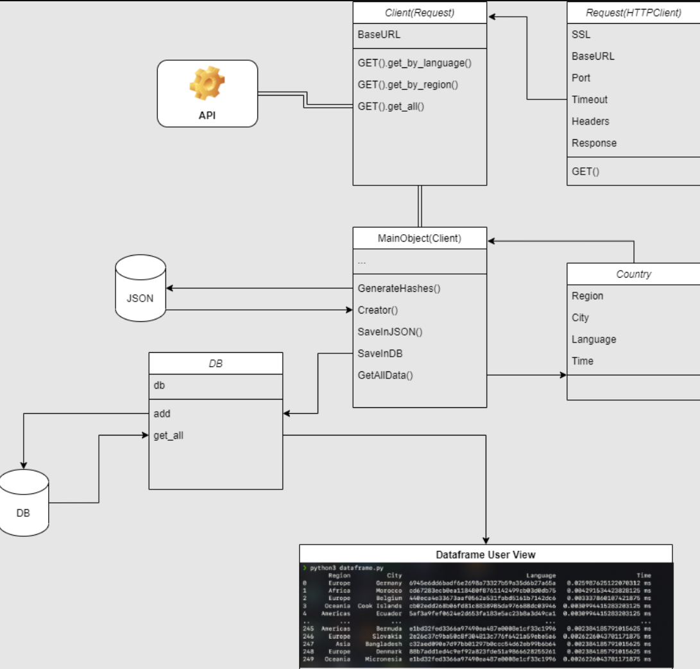

# Prueba Técnica

- [x] De https://restcountries.com/ obtenga el nombre del idioma que habla el país y encriptelo con SHA1 
- [x] En la columna Time ponga el tiempo que tardó en armar la fila (debe ser automático)
- [x] La tabla debe ser creada en un DataFrame con la librería PANDAS 
- [x] Con funciones de la librería pandas muestre el tiempo total, el tiempo promedio, el tiempo mínimo y el máximo que tardo en procesar todas las filas de la tabla
- [x] Guarde el resultado en sqlite
- [x] Genere un Json de la tabla creada y guárdelo como data.json
- [x] No usar librerías de terceros (La aplicación no necesita de ningún framework para correr, es decir, con los propios módulos de python, la aplicación puede crear la BD, generar el JSON, y hashear el lenguaje sin necesitar pandas)

### Solución

La idea general sobre esta solución es consumir la API, procesar los datos y guardarlos en la DB, para luego ser procesados más rápido en Pandas, de esa forma, los datos, al no ser dinámicos, pueden consumirse en local al instante.

1. Primero se creó el Cliente a partir de una clase llamada Request que hereda a su vez hereda la funcionalidad de [http.client](https://docs.python.org/es/3/library/http.client.html#module-http.client).
Al cliente se le añaden los métodos que consumen la API.
2. Se creó un controlador de la base de datos, que envuelve la funcionalidad de INSERT INTO y SELECT * FROM propia de [SQL](https://docs.python.org/3/library/sqlite3.html)
3. Se creó una clase de datos llamada Country, que almacena datos de la tabla.
4. Se creó una entidad principal llamada MainObject que funciona como un puente entre la API y la DB. Esta clase tiene un método que hashea el lenguaje y lo almacena en hashes.json, que se utiliza para crear Country.
El método creator crea a Country y luego regresa el diccionario de cada uno de las propiedades del objeto.
La propiedad get_all_data, llama al cliente que consume la API y regresa la llamada en string que luego convierte a JSON (porqué http.client únicamente recibe bytes y no posee métodos que conviertan a JSON).
5. Finalmente a través un [script](https://github.com/AlfonsoAgAr/rest_countries/blob/master/src/dataframe.py) o de un [cuaderno](https://github.com/AlfonsoAgAr/rest_countries/blob/master/src/Solucion_1.ipynb), se pueden servir los datos en Pandas para mostrar las estadísticas y la Tabla.

---
Se realizaron [pruebas unitarias](https://github.com/AlfonsoAgAr/rest_countries/blob/master/tests/request_test.py) al Cliente ya que es el principal proveedor de datos de la aplicación.
